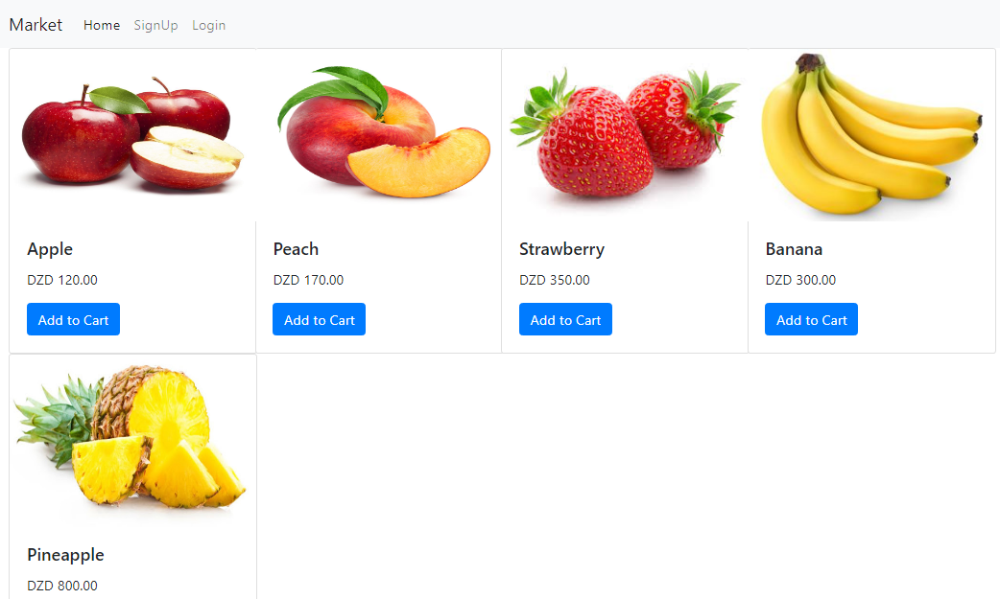
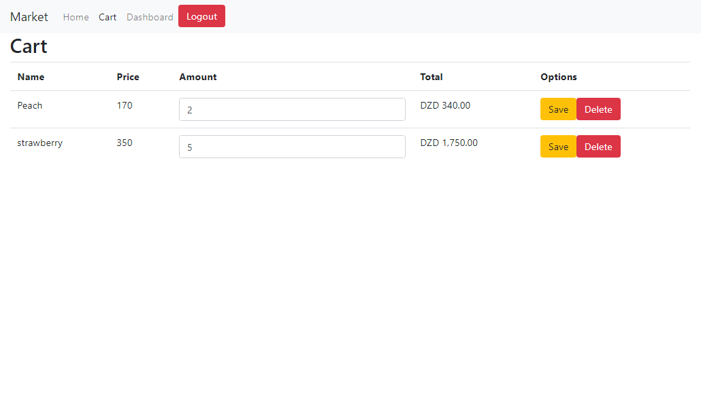

# Basic E-Commerce Web App
Part of my learning of making Full-Stack web application using Angular &amp; Firebase in the back-end.

### Used Language & Technologies
* Angular9
* Bootstrap
* Firebase (Authentication, Firestore Database, FireStorage, Hosting)

### Screenshots
Home           |
:---------------------:|
 |
Shopping Cart |
 |

## Contributing 💡
If you want to contribute to this project and make it better with new ideas, your pull request is very welcomed.
If you find any issue just put it in the repository issue section, thank you.

## Contact me
Email: houarizegai14@gmail.com  
LinkedIn: [HouariZegai](https://linkedin.com/in/houarizegai)  
Twitter: [@HouariZegai](https://twitter.com/houarizegai)
